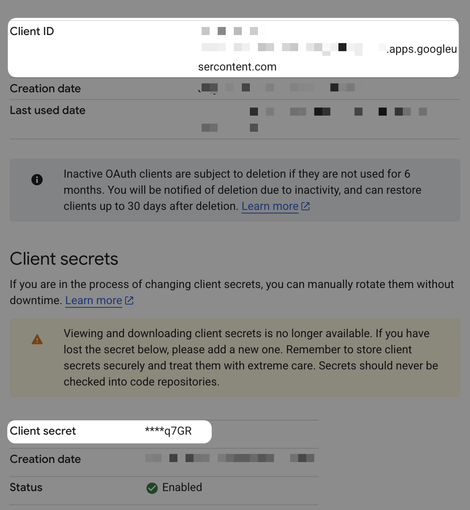
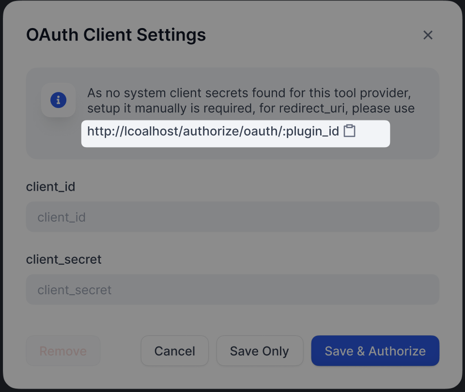

Retrieves Email from your Gmail inbox matching filter criteria. To configure OAuth Client:

### 1. Create a new project in Google Cloud Console

Enable Gmail APIs and configure the OAuth consent screen. Publish the app or enter test users as needed.

### 2. Fill in credentials in Dify

On Gmail tool's OAuth Client Setup popup, fill in the auth credentials from the Google OAuth Client you configured:

### 3. Authorize the Redirect URI in Google Cloud Console

Dify displays the `redirect_uri` in the OAuth Client configuration popup:

Enter this as the Authorized redirect URI in your OAuth Client’s page in Google Cloud Console.

### 4. Click on `Save & Authorize` to finish the OAuth setup
